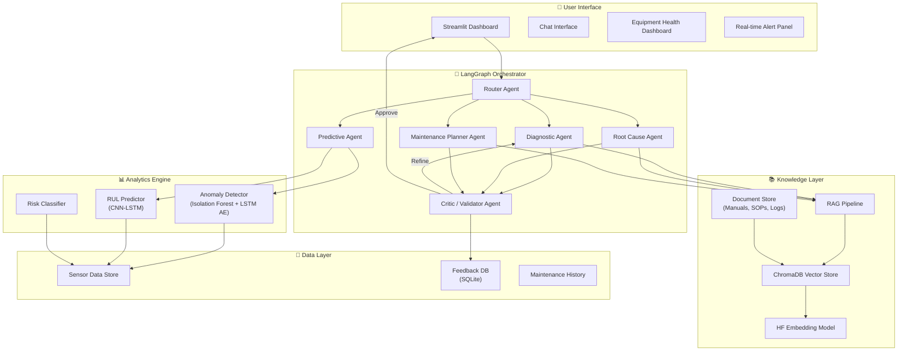
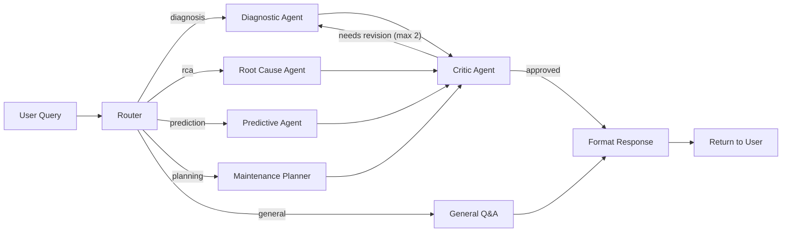

# 🏭 Intelligent Maintenance Wizard — Steel Manufacturing
## TATA AI Hackathon | Round 2 — Agentic AI Challenge

> **Goal:** Build an intelligent, context-aware Maintenance Wizard that consolidates equipment manuals, SOPs, sensor data, failure logs, and spare parts info to help steel-plant maintenance engineers diagnose issues faster, predict failures, and receive prioritized, explainable maintenance recommendations — all through natural-language conversation.

---

## User Review Required

> [!IMPORTANT]
> **Tech-Stack Decision — LangGraph vs Alternatives**
> After thorough research, **LangGraph** is the clear winner for this project. It offers:
> - **Stateful graph-based orchestration** — perfect for multi-agent loops (retrieve → reason → validate → respond)
> - **Built-in checkpointing** — enables conversation memory and session persistence
> - **Human-in-the-loop support** — critical for high-stakes maintenance decisions
> - **Cyclical workflows** — allows "critic → refine" loops for self-correcting outputs
>
> CrewAI is faster to prototype but lacks the fine-grained control needed for industrial reliability. AutoGen is experimental and harder to stabilize.

> [!WARNING]
> **Model Hosting Constraint**
> Since we're using open-source Hugging Face models, we need either:
> 1. **HuggingFace Inference API (free tier)** — simplest, but rate-limited
> 2. **Local hosting via Ollama or vLLM** — better for demo day, needs GPU
> 3. **Together.ai / Groq free tier** — fast inference for open-source models
>
> **Please confirm which hosting approach you prefer**, or if you have access to a GPU machine.

---

## Open Questions

> [!IMPORTANT]
> 1. **Do you have sample data?** Equipment manuals, SOPs, maintenance logs, sensor CSVs? If not, I'll generate realistic synthetic data for the steel plant domain.
> 2. **GPU access?** Do you have a machine with an NVIDIA GPU (for local model inference), or should we rely on cloud APIs (HuggingFace Inference / Together.ai / Groq)?
> 3. **Team size & timeline?** How many days do you have? This affects which optional enhancements we prioritize.
> 4. **Deployment target?** Local demo only, or do you need cloud deployment (e.g., HuggingFace Spaces)?

---

## Architecture Overview



---

## Proposed Tech Stack

| Layer | Technology | Rationale |
|:------|:-----------|:----------|
| **Orchestration** | **LangGraph** | Stateful multi-agent graphs, cyclical workflows, checkpointing |
| **LLM (Primary)** | **Qwen 2.5 7B / 14B** (HuggingFace) | Best reasoning-to-size ratio, strong structured output |
| **LLM (Fallback)** | **Llama 3.2 3B** (for routing/validation) | Lightweight SLM for fast routing decisions |
| **Embeddings** | **sentence-transformers/all-MiniLM-L6-v2** | Fast, accurate, lightweight — perfect for RAG |
| **Vector Store** | **ChromaDB** | Built-in metadata filtering, persistence, easy LangChain integration |
| **Anomaly Detection** | **Isolation Forest + LSTM Autoencoder** | Isolation Forest for quick anomalies, LSTM-AE for complex patterns |
| **RUL Prediction** | **CNN-LSTM (PyTorch)** | Captures spatial + temporal dependencies in sensor data |
| **Frontend** | **Streamlit** | Rich dashboards, chat UI, real-time updates, rapid development |
| **Visualization** | **Plotly** | Interactive charts for sensor trends, equipment health, anomalies |
| **Database** | **SQLite** | Lightweight, zero-config for feedback loop and maintenance logs |
| **Document Parsing** | **PyMuPDF + Unstructured** | Parse PDFs, DOCXs, and structured maintenance documents |
| **API Framework** | **FastAPI** (optional) | REST endpoints if needed for external integration |

---

## Proposed Changes

### Component 1: Project Foundation & Configuration

#### [NEW] Project Structure
```
tata-ai-hackathon/
├── app.py                          # Streamlit main entry point
├── config.py                       # All configuration constants
├── requirements.txt                # Python dependencies
├── .env.example                    # Environment variable template
│
├── agents/                         # LangGraph agent definitions
│   ├── __init__.py
│   ├── graph.py                    # Main LangGraph workflow
│   ├── state.py                    # Shared state schema (TypedDict)
│   ├── router_agent.py             # Intent classification & routing
│   ├── diagnostic_agent.py         # Fault diagnosis agent
│   ├── rca_agent.py                # Root cause analysis agent
│   ├── predictive_agent.py         # Anomaly + RUL prediction agent
│   ├── maintenance_planner.py      # Maintenance recommendation agent
│   └── critic_agent.py             # Output validation & refinement
│
├── rag/                            # RAG pipeline
│   ├── __init__.py
│   ├── document_loader.py          # Load & chunk documents
│   ├── embeddings.py               # HuggingFace embedding wrapper
│   ├── vector_store.py             # ChromaDB operations
│   └── retriever.py                # Hybrid search retriever
│
├── analytics/                      # ML models for prediction
│   ├── __init__.py
│   ├── anomaly_detector.py         # Isolation Forest + LSTM-AE
│   ├── rul_predictor.py            # CNN-LSTM for remaining useful life
│   ├── risk_classifier.py          # Risk level classification
│   └── models/                     # Saved model weights
│
├── data/                           # Sample / synthetic data
│   ├── manuals/                    # Equipment manuals (PDFs)
│   ├── sops/                       # Standard Operating Procedures
│   ├── logs/                       # Maintenance & failure logs (CSV)
│   ├── sensor_data/                # Simulated sensor data (CSV)
│   └── spare_parts/                # Spare parts inventory (CSV)
│
├── ui/                             # Streamlit UI components
│   ├── __init__.py
│   ├── chat_interface.py           # Conversational chat component
│   ├── dashboard.py                # Equipment health dashboard
│   ├── alert_panel.py              # Real-time alert display
│   ├── report_generator.py         # Structured report output
│   └── styles.py                   # Custom CSS for premium look
│
├── utils/                          # Shared utilities
│   ├── __init__.py
│   ├── logger.py                   # Structured logging
│   ├── data_generator.py           # Synthetic data generation
│   └── feedback.py                 # Feedback loop management
│
├── docs/                           # Documentation
│   ├── architecture.md             # System architecture document
│   ├── tech_stack.md               # Technology choices explained
│   ├── setup_guide.md              # Installation & running guide
│   └── sample_io.md                # Sample input/output demos
│
└── tests/                          # Test suite
    ├── test_rag.py
    ├── test_agents.py
    └── test_analytics.py
```

---

### Component 2: Data Layer — Synthetic Data Generation

Since this is a hackathon, we'll generate **realistic synthetic data** for a steel plant:

#### [NEW] `utils/data_generator.py`
- Generate **equipment manuals** for: Blast Furnace, Basic Oxygen Furnace (BOF), Rolling Mill, Caster, Ladle Furnace
- Generate **maintenance SOPs** with step-by-step procedures
- Generate **historical maintenance logs** (CSV): `equipment_id, timestamp, fault_code, description, action_taken, downtime_hours, severity`
- Generate **sensor data** (CSV): `timestamp, equipment_id, temperature, vibration, pressure, rpm, current, oil_level` — with injected anomalies
- Generate **spare parts inventory** (CSV): `part_id, part_name, equipment_id, quantity, lead_time_days, cost, supplier`
- Generate **failure analysis reports** as structured text documents

---

### Component 3: RAG Pipeline — Knowledge Integration

#### [NEW] `rag/document_loader.py`
- Load PDFs (equipment manuals) using PyMuPDF
- Load text/markdown SOPs
- Load CSVs (maintenance logs) as structured text
- **Chunking strategy**: RecursiveCharacterTextSplitter with 1000 chars, 200 overlap
- Add **metadata tags**: `{equipment_id, doc_type, section, date}`

#### [NEW] `rag/vector_store.py`
- Initialize ChromaDB with persistent storage
- Create **namespace-isolated collections**: `manuals`, `sops`, `maintenance_logs`, `failure_reports`
- Support metadata filtering by equipment ID and document type
- Hybrid search: combine semantic similarity + keyword matching

#### [NEW] `rag/retriever.py`
- Multi-collection retrieval with relevance scoring
- Context window management (max ~3000 tokens per retrieval)
- Source citation tracking for explainability

---

### Component 4: LangGraph Multi-Agent System

This is the **core** of the project — a stateful graph with specialized agents.

#### [NEW] `agents/state.py`
```python
class MaintenanceState(TypedDict):
    # User input
    user_query: str
    conversation_history: list[dict]
    
    # Routing
    intent: str  # "diagnosis", "rca", "prediction", "planning", "general"
    equipment_id: str | None
    
    # Retrieved context
    retrieved_docs: list[dict]
    sensor_data: dict | None
    
    # Agent outputs
    diagnosis: str | None
    root_cause: str | None
    predictions: dict | None
    maintenance_plan: str | None
    risk_level: str | None  # "low", "medium", "high", "critical"
    
    # Validation
    is_validated: bool
    critic_feedback: str | None
    revision_count: int
    
    # Final output
    final_response: str
    sources: list[str]
    alerts: list[dict]
```

#### [NEW] `agents/graph.py` — The LangGraph Workflow



**Key design decisions:**
- **Router Agent** uses Llama 3.2 3B (fast, cheap) for intent classification
- **Specialist Agents** use Qwen 2.5 7B/14B (strong reasoning) with RAG context
- **Critic Agent** validates output quality, completeness, and factual accuracy
- Maximum 2 revision loops to prevent infinite cycles
- Each agent has access to relevant tools (RAG retriever, sensor analyzer, risk calculator)

#### [NEW] `agents/router_agent.py`
- Classify user intent into: `diagnosis`, `rca`, `prediction`, `planning`, `general`
- Extract equipment ID from query using regex + NER
- Route to appropriate specialist agent

#### [NEW] `agents/diagnostic_agent.py`
- Accepts fault descriptions, error codes, or symptom descriptions
- Retrieves relevant sections from equipment manuals and historical logs
- Generates structured diagnosis with:
  - **Probable fault** (with confidence level)
  - **Evidence** (cited from retrieved documents)
  - **Immediate action** required
  - **Risk assessment**

#### [NEW] `agents/rca_agent.py`
- Performs root cause analysis by correlating:
  - Historical failure patterns for the same equipment
  - Sensor data trends leading up to the incident
  - Known failure modes from manuals
- Outputs structured RCA with **5-Why analysis** and **Fishbone diagram data**

#### [NEW] `agents/predictive_agent.py`
- Calls the anomaly detection model to identify current abnormalities
- Calls the RUL predictor to estimate remaining equipment life
- Generates early warnings for potential catastrophic failures
- Integrates sensor data analysis with historical trends

#### [NEW] `agents/maintenance_planner.py`
- Generates prioritized maintenance recommendations considering:
  - Process criticality
  - Delay severity
  - Spare parts availability and procurement lead time
  - Current workload and scheduling constraints
- Outputs: immediate actions, short-term plan, long-term monitoring strategy

#### [NEW] `agents/critic_agent.py`
- Validates agent outputs for:
  - Completeness (all required sections present)
  - Factual accuracy (cross-reference with retrieved docs)
  - Safety considerations
  - Actionability (are recommendations specific enough?)
- Returns `approved` or `needs_revision` with specific feedback

---

### Component 5: Analytics Engine — Anomaly Detection & Prediction

#### [NEW] `analytics/anomaly_detector.py`
- **Isolation Forest** — fast, unsupervised anomaly detection on multi-variate sensor data
- **LSTM Autoencoder** — trained on "normal" sensor patterns, flags high reconstruction error as anomaly
- Combines both scores for robust detection
- Configurable thresholds per equipment type

#### [NEW] `analytics/rul_predictor.py`
- **CNN-LSTM architecture** in PyTorch:
  - 1D CNN layers to extract local sensor patterns
  - LSTM layers to capture temporal dependencies
  - Fully connected layers for RUL regression
- Trained on synthetic degradation data (inspired by NASA C-MAPSS)
- Outputs: estimated remaining useful life in hours/days + confidence interval

#### [NEW] `analytics/risk_classifier.py`
- Multi-factor risk assessment combining:
  - Current anomaly score
  - RUL estimate
  - Historical failure frequency
  - Equipment criticality rating
- Outputs: `low`, `medium`, `high`, `critical` with justification

---

### Component 6: Streamlit UI — Premium Dashboard

#### [NEW] `app.py` — Main application with 4 tabs:

**Tab 1: 💬 Maintenance Chat**
- Conversational interface with multi-turn support
- Context-aware follow-up questions
- Source citations displayed alongside responses
- Chat history with session persistence

**Tab 2: 📊 Equipment Health Dashboard**
- Interactive Plotly charts showing:
  - Real-time sensor readings (temperature, vibration, pressure, RPM)
  - Anomaly detection overlay (highlighted anomalous regions)
  - RUL countdown for each piece of equipment
  - Historical trend analysis
- Equipment selector (dropdown/sidebar)
- Color-coded health status cards

**Tab 3: 🚨 Alert Center**
- Real-time abnormality alerts with severity badges
- Alert history with filtering (by equipment, severity, date)
- One-click "Investigate" button that routes to the chat with context

**Tab 4: 📋 Reports**
- Generate structured maintenance reports
- Download as PDF/Markdown
- Maintenance decision summaries
- Digital maintenance logbook entries

#### [NEW] `ui/styles.py` — Premium dark-mode CSS
- Dark glassmorphism theme with:
  - Gradient accent colors (electric blue → teal)
  - Frosted glass cards with `backdrop-filter: blur()`
  - Smooth animations and transitions
  - Custom font (Inter from Google Fonts)
  - Professional industrial aesthetic

---

### Component 7: Feedback Loop — Continuous Improvement

#### [NEW] `utils/feedback.py`
- SQLite-backed feedback storage
- After each response, user can:
  - 👍 Confirm recommendation was helpful
  - 👎 Mark as incorrect/unhelpful  
  - ✏️ Provide corrective feedback
- Feedback is stored and used to:
  - Adjust retrieval weights
  - Flag frequently incorrect responses
  - Generate fine-tuning datasets (future enhancement)

---

## Implementation Phases

### Phase 1: Foundation (Day 1)
- [ ] Project setup, dependencies, configuration
- [ ] Synthetic data generation (manuals, SOPs, logs, sensor data)
- [ ] RAG pipeline (document loading, chunking, ChromaDB indexing)
- [ ] Basic LLM integration (HuggingFace model loading)

### Phase 2: Core Agents (Day 2)
- [ ] LangGraph state schema and workflow graph
- [ ] Router Agent implementation
- [ ] Diagnostic Agent + RAG integration
- [ ] RCA Agent implementation
- [ ] Maintenance Planner Agent
- [ ] Critic Agent with revision loop

### Phase 3: Analytics & Prediction (Day 2-3)
- [ ] Anomaly detection (Isolation Forest + LSTM Autoencoder)
- [ ] RUL prediction model (CNN-LSTM)
- [ ] Risk classification logic
- [ ] Predictive Agent integration

### Phase 4: UI & Polish (Day 3)
- [ ] Streamlit chat interface
- [ ] Equipment health dashboard with Plotly
- [ ] Alert center
- [ ] Report generator
- [ ] Premium dark-mode styling
- [ ] Feedback system

### Phase 5: Documentation & Demo (Day 4)
- [ ] Architecture documentation
- [ ] Setup guide
- [ ] Sample I/O demonstration
- [ ] Screen recording
- [ ] Final testing and bug fixes

---

## Verification Plan

### Automated Tests
```bash
# Unit tests for RAG pipeline
pytest tests/test_rag.py -v

# Integration tests for agent graph
pytest tests/test_agents.py -v

# Smoke test the full pipeline
python -m pytest tests/ -v --timeout=120
```

### Manual Verification
1. **Chat Flow Test**: Ask 5 different types of queries (diagnosis, RCA, prediction, planning, general) and verify structured, explainable responses
2. **Multi-turn Conversation**: Verify context persistence across follow-up questions
3. **Dashboard Test**: Verify sensor charts render correctly with anomaly highlighting
4. **Alert Test**: Inject anomalous data and verify alert generation
5. **Report Test**: Generate a structured maintenance report and verify formatting

### Demo Scenarios (for screen recording)
1. *"The blast furnace cooling system is showing unusual vibration readings. What could be wrong?"*
2. *"Show me the health status of all critical equipment"*
3. *"What is the remaining useful life of Rolling Mill Motor RM-003?"*
4. *"Generate a maintenance plan for the next quarter prioritized by criticality"*
5. *"We had a bearing failure on BOF-002 last week. Perform root cause analysis."*

---

## Key Differentiators (What Makes This Stand Out)

| Feature | Why It Matters |
|:--------|:---------------|
| **Multi-Agent LangGraph Architecture** | Shows sophisticated agentic AI design, not just "LLM + prompt" |
| **Critic-Refine Loop** | Self-correcting system — outputs are validated before delivery |
| **Hybrid Anomaly Detection** | Combines statistical (Isolation Forest) + deep learning (LSTM-AE) |
| **Explainable Outputs** | Every recommendation cites its source documents |
| **Feedback-Driven Learning** | System improves from engineer corrections |
| **Premium Industrial UI** | Dark glassmorphism dashboard looks production-grade |
| **End-to-End Pipeline** | From raw data → indexed knowledge → agent reasoning → structured output |

---

## Dependencies (requirements.txt preview)

```txt
# Core
langgraph>=0.2.0
langchain>=0.3.0
langchain-community>=0.3.0
langchain-huggingface>=0.1.0

# LLM & Embeddings
transformers>=4.45.0
sentence-transformers>=3.0.0
huggingface-hub>=0.25.0

# Vector Store
chromadb>=0.5.0

# Analytics
torch>=2.0.0
scikit-learn>=1.5.0
numpy>=1.26.0
pandas>=2.2.0

# UI
streamlit>=1.39.0
plotly>=5.24.0

# Document Processing
pymupdf>=1.24.0
unstructured>=0.15.0

# Utils
python-dotenv>=1.0.0
pydantic>=2.9.0
sqlalchemy>=2.0.0
```
